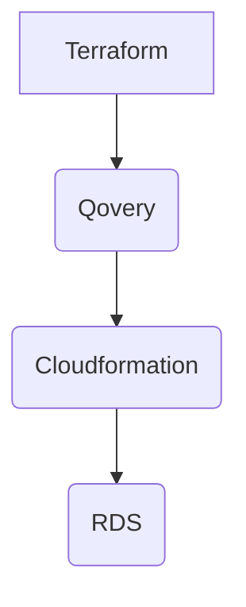
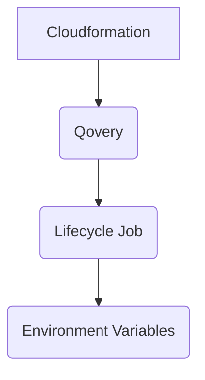

# Qovery - Deploy RDS Postgres with Cloudformation

This repository contains a Terraform configuration to create a Qovery Lifecycle Job that will deploy a Cloudformation stack that creates an RDS Postgres instance.



Note: The Terraform here is only responsible for creating the Qovery Lifecycle Job. The Cloudformation stack is responsible for creating the RDS instance.

## Prerequisites

- Terraform
- [Qovery](https://www.qovery.com) account

## How to deploy

1. Clone this repository
    1. Adapt the [main.yaml](cloudformation/main.yaml) file to your needs. You can change the instance class, storage size, encryption, etc.
2. Run `terraform init`
3. Set the [following environment variables](variables.tf):
    1. `TF_VAR_qovery_api_token` - Your Qovery API token
    2. `TF_VAR_qovery_environment_id` - Your Qovery environment ID where you want to deploy the RDS instance
    3. `TF_VAR_VPC_SECURITY_GROUP_ID` - The VPC security group ID for the RDS instance
    4. `TF_VAR_AWS_ACCESS_KEY_ID` - Your AWS access key ID for Cloudformation
    5. `TF_VAR_AWS_SECRET_ACCESS_KEY` - Your AWS secret access key for Cloudformation
    6. `TF_VAR_AWS_DEFAULT_REGION` - The AWS region to deploy the RDS instance
    7. `TF_MASTER_USERNAME` - The master username for the RDS instance
    8. `TF_MASTER_PASSWORD` - The master password for the RDS instance
    9. `TF_DATABASE_NAME` - The database name for the RDS instance

```bash
export TF_VAR_qovery_api_token="your_qovery_api_token" \
TF_VAR_qovery_environment_id="your_qovery_environment_id" \
TF_VAR_VPC_SECURITY_GROUP_ID="your_vpc_security_group_id" \
TF_VAR_AWS_ACCESS_KEY_ID="your_aws_access_key_id" \
TF_VAR_AWS_SECRET_ACCESS_KEY="your_aws_secret_access_key" \
TF_VAR_AWS_DEFAULT_REGION="your_aws_default_region" \
TF_MASTER_USERNAME="your_master_username" \
TF_MASTER_PASSWORD="your_master_password" \
TF_DATABASE_NAME="your_database_name"
```

4. Run `terraform apply`
5. [Connect to your Qovery project and environment](https://console.qovery.com), you should see a new Lifecycle Job called `RDS Postgres`.

This will create a Qovery Lifecycle Job that will deploy the Cloudformation stack.

## How to remove

1. Run `terraform destroy`

## How to update

1. Update the Cloudformation stack in the `cloudformation` directory
2. Run `terraform apply`
3. Redeploy the application in Qovery

## Cloudformation Outputs

The Cloudformation output values are stored in the Qovery environment variables. You can access them in your application code using the following environment variables:

- `DB_INSTANCE_ENDPOINT` - The RDS instance endpoint
- `DB_INSTANCE_PORT` - The RDS instance port
- `DB_INSTANCE_IDENTIFIER` - The RDS instance identifier

You can get the list of environment variables right from the Qovery console for your job and in your [cloudformation template](cloudformation/main.yaml) in the Outputs section.

The flow is as follows:

